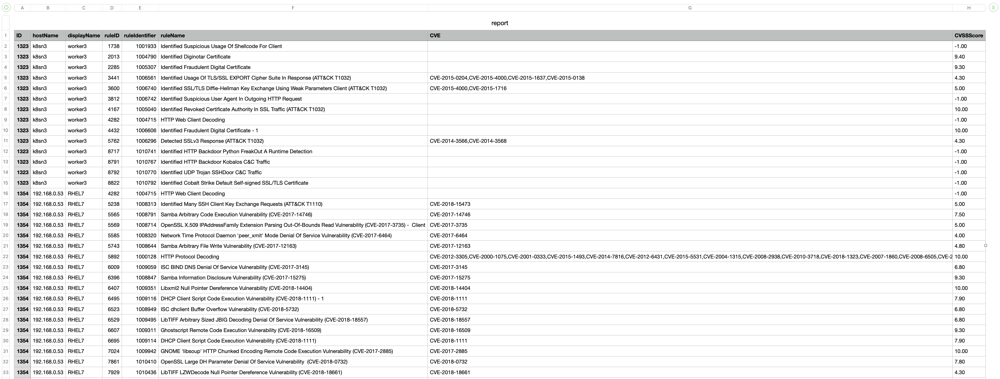

# Report Assigned IPS Rules

Creates a report in CSV format containing all computer objects and their IPS rules assigned. The rules are included with the covered CVEs and CVE score

It reports the following information:

ID | hostName | displayName | ruleID | ruleIdentifier | ruleName | CVE | CVSSScore
-- | -- | -- | -- | -- | -- | -- | -- | 

Configure by populating the `config.yml`

```yaml
deepsecurity:
  server: https://app.deepsecurity.trendmicro.com:443
  api_key: <api key>
report_file: "report.csv"
```

Run by

```sh
python3 report_assgined_ipsrules.py
```

Output:


