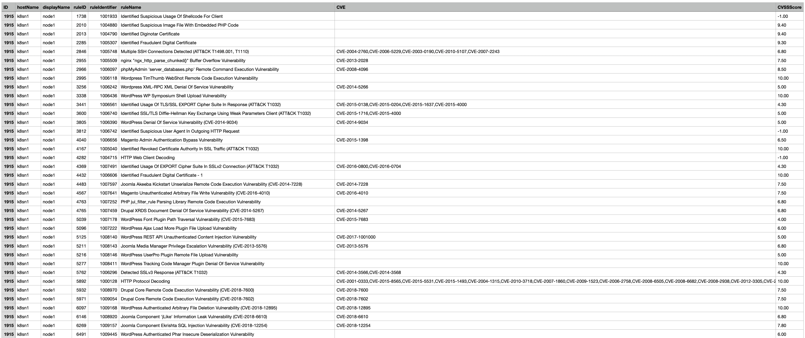
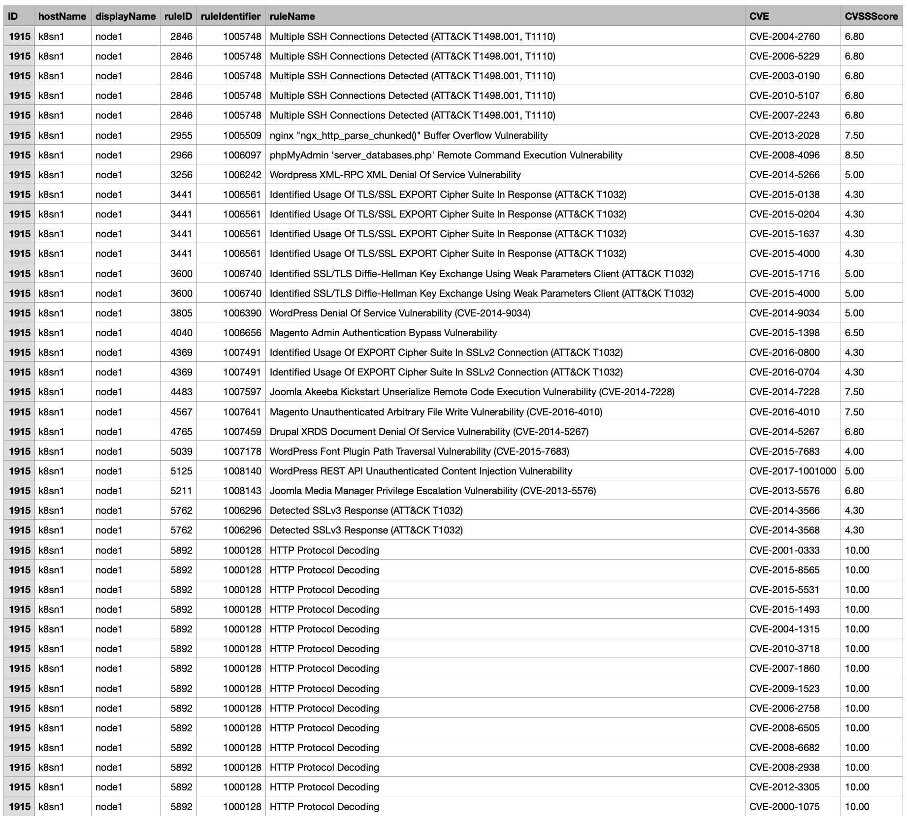

# report-assigned-ips-rules

Creates a CSV report containing assigned IPS rules with their CVEs.

## Examples

Report style with a single line per rule:



Report style with multiple lines per rule and CVE:



## Configuration

```sh
cp config.yaml.sample config.yaml
```

Adapt it to your configuration

```yaml
# URL and API-Key for Workload / Deep Security
deepsecurity:
  server: workload.us-1.cloudone.trendmicro.com
  api_key: <api key>

# report file name
report_file: "report.csv"

# single - creates one line for an assigned IPS rule, even if it covers multiple CVEs
# multi - creates one line for an assgined IPS rule / CVE pair
report_mode: single
```

Ensure to have the requirements satisfied

```sh
pip3 install -r requirements.txt
```

## Run

```sh
python3 report_assgined_ipsrules.py
```
