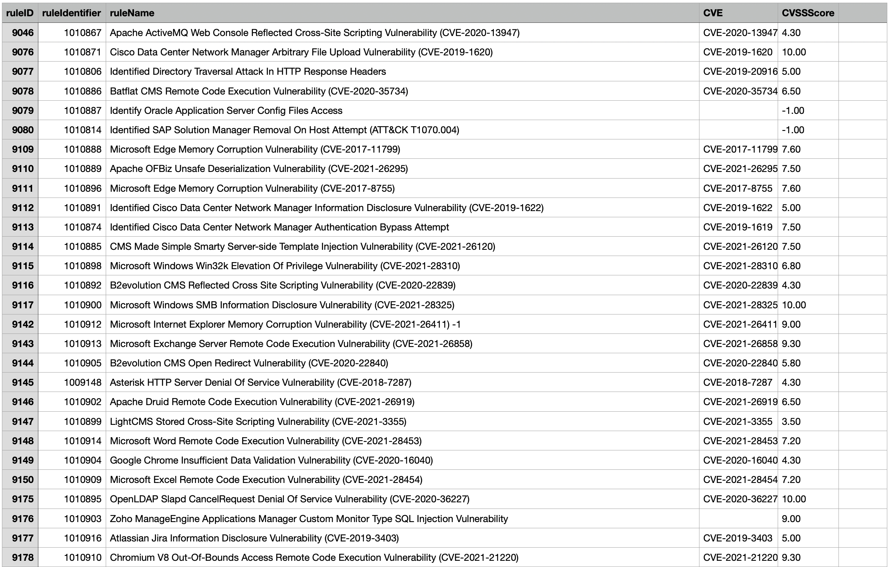

# report-ips-rule-inventory

Creates a CSV report containing all available IPS rules with their CVEs.

## Examples

Report:



## Configuration

```sh
cp config.yaml.sample config.yaml
```

Adapt it to your configuration

```yaml
# URL and API-Key for Workload / Deep Security
deepsecurity:
  server: workload.us-1.cloudone.trendmicro.com
  api_key: <api key>

# report file name
report_file: "report.csv"
```

Ensure to have the requirements satisfied

```sh
pip3 install -r requirements.txt --user
```

## Run

```sh
python3 ips_rule_id_identifier.py
```
