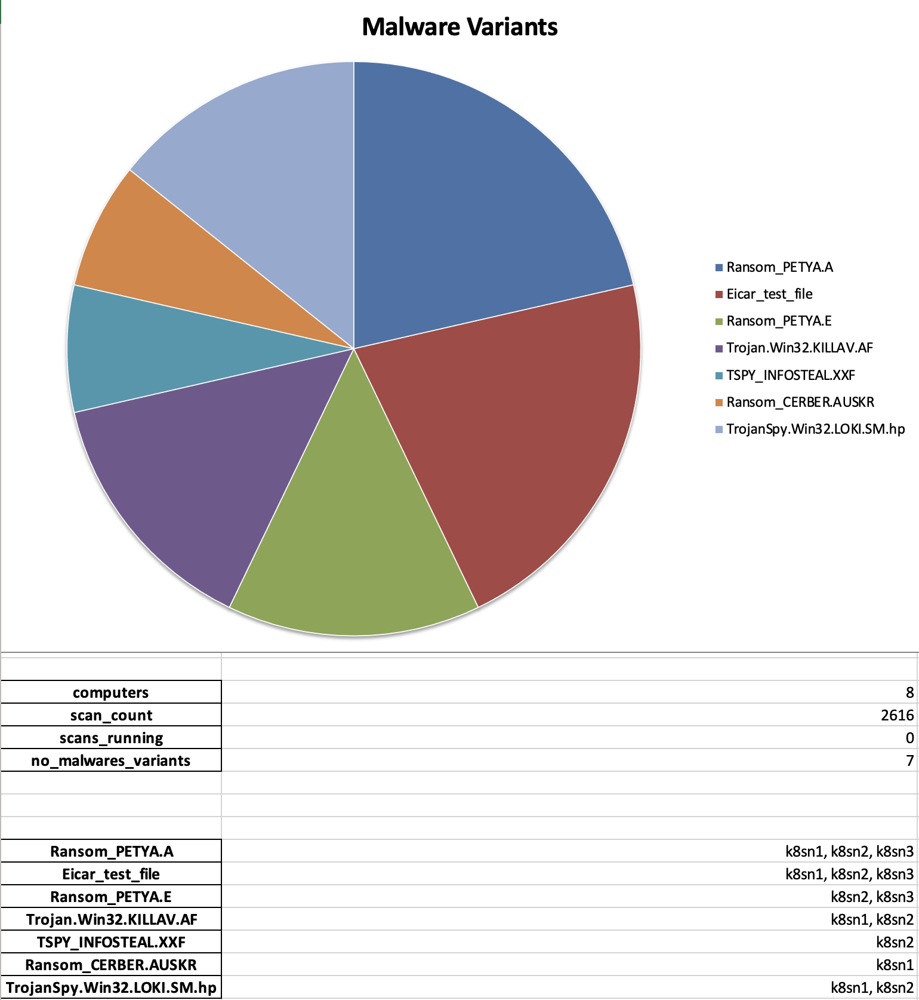

# Anti-Malware Scheduled Scan Report

An example report in Excel format containing a high level overview of malware findings discoverd by scheduled scans.

It reports the following information:

Chart:

* Pie chart of the malware types discoverd and their occurrences within the given time frame

Statistics Table:

* Number of computers protected by Workload Security
* Number of scheduled scans within the given time frame
* Number of scheduled scans currently running
* Number of different malware variants discovered

Malware Discoveries on Computers:

* Malware variant discovered on which computers

Configure by populating the `config.yml`

```yaml
deepsecurity:
  server: https://app.deepsecurity.trendmicro.com:443
  api_key: <api key>
  tenant: <tenant name>
  tenant_id: <tenant id>
  token: <token>
  username: <cloud one username>
  password: <cloud one password>
  # timespan from
  timespan_from: "02.08.2021"
  # timespan to
  timespan_to: "02.08.2021"
```

Run by

```sh
python3 antimalware_report.py
```

Output:


